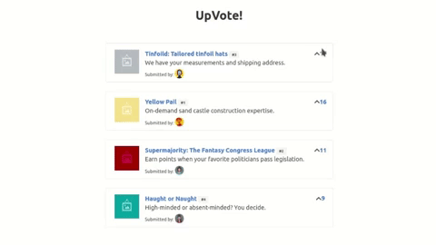

<h3 align="center">UpVotes</h3> 

## About

A tiny project for the study of VueJS Framework.

### Framework Aspects Studied
- Data Model
- Vue Instance
- Data Binding
- List Rendering With v-for Directive
- Computed Properties
- Event handling
- Reactive State
- Class Binding
- Components